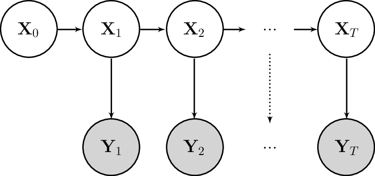

# SSMProblems

## Installation

In the `julia` REPL:

```julia
] add SSMProblems
```

## Documentation

`SSMProblems` defines a minimal interface for _state space models_ (SSMs). It owns only
the substrate that filtering and smoothing algorithms agree on: three process abstract
types, the `distribution`/`simulate`/`logdensity` generics, and a plain model container.
Inference packages such as
[GeneralisedFilters](https://github.com/TuringLang/GeneralisedFilters.jl) build their
algorithms, parameter types and conditioning mechanisms on top of it, so a model written
against this interface can be handed to any of them.

Consider a standard (Markovian) state-space model from[^Murray]:


[^Murray]:
    > Murray, Lawrence & Lee, Anthony & Jacob, Pierre. (2013). Rethinking resampling in the particle filter on graphics processing units.

The following three distributions fully specify the model:

- The __initialisation__ distribution, ``f_0``, for the initial latent state ``X_0``
- The __transition__ distribution, ``f``, for the latent state ``X_t`` given the previous ``X_{t-1}``
- The __observation__ distribution, ``g``, for an observation ``Y_t`` given the state ``X_t``

The dynamics of the model are given by,

```math
\begin{aligned}
x_0 &\sim f_0(x_0) \\
x_t | x_{t-1} &\sim f(x_t | x_{t-1}) \\
y_t | x_t &\sim g(y_t | x_{t})
\end{aligned}
```

and the joint law is,

```math
p(x_{0:T}, y_{1:T}) = f_0(x_0) \prod_{t=1}^{T} g(y_t | x_t) f(x_t | x_{t-1}).
```

We can consider a state space model as being made up of two components:

- A latent Markov chain describing the evolution of the latent state
- An observation process describing the relationship between the latent states and the observations

Through this lens, we see that the distributions ``f_0``, ``f`` fully describe the latent Markov chain, whereas ``g`` describes the observation process.

A user of `SSMProblems` may define these three distributions directly. Alternatively, they
can define a subset of methods for sampling and evaluating log-densities of the
distributions, depending on the requirements of the filtering/smoothing algorithms they
intend to use.

Using the first approach, we can define a simple linear state space model as follows:

```julia
using Distributions
using Random
using SSMProblems

struct SimplePrior <: StatePrior end

SSMProblems.distribution(::SimplePrior) = Normal(0.0, 1.0)

struct SimpleLatentDynamics <: LatentDynamics end

SSMProblems.distribution(::SimpleLatentDynamics, step::Int, state) = Normal(state, 0.1)

struct SimpleObservationProcess <: ObservationProcess end

SSMProblems.distribution(::SimpleObservationProcess, step::Int, state) = Normal(state, 0.5)

# Construct an SSM from the components
model = StateSpaceModel(
    SimplePrior(), SimpleLatentDynamics(), SimpleObservationProcess()
)

# Forward simulate a trajectory of length 10
x0, xs, ys = simulate(model, 10)
```

There are a few things to note here:

- The prior takes no `step`/`state` arguments; the dynamics and observation process take
  both.
- No method takes keyword arguments. Anything a component depends on — parameters,
  controls, exogenous inputs — is stored in the component itself and indexed by `step`.
  Building components per step is the job of the inference package, which can then express
  the dependence in whatever way suits its algorithms and its automatic differentiation.
- If your latent dynamics or observation process cannot be represented as a `Distribution`
  object, implement `simulate` and/or `logdensity` directly instead, as documented below.

These distribution definitions are used to derive the `simulate` and `logdensity` methods
for each component. Package users then interact with the state space model through those
functions.

For example, a bootstrap filter targeting the filtering distribution ``p(x_t | y_{0:t})``
using `N` particles would roughly follow:

```julia
dyn, obs = model.dyn, model.obs

for (t, observation) in enumerate(observations)
    idx = resample(rng, log_weights)
    particles = particles[idx]
    for i in 1:N
        particles[i] = simulate(rng, dyn, t, particles[i])
        log_weights[i] += logdensity(obs, t, particles[i], observation)
    end
end
```

For more thorough examples, see the provided example scripts.

### Interface
```@autodocs
Modules = [SSMProblems]
Order   = [:type, :function, :module]
```
