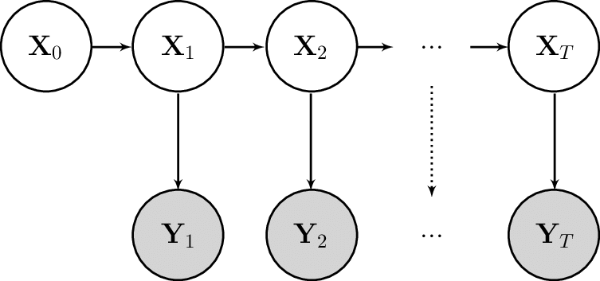

# SSMProblems

## Installation

In the `julia` REPL:

```julia
] add SSMProblems
```

## Documentation

`SSMProblems` defines a generic interface for _state space models_ (SSMs). Its
main objective is to provide a consistent interface for filtering and smoothing
algorithms to interact with.

Consider a standard (Markovian) state space model from[^Murray]:


[^Murray]:
    > Murray, Lawrence & Lee, Anthony & Jacob, Pierre. (2013). Rethinking resampling in the particle filter on graphics processing units.

The model is fully specified by the following three distributions:

- The __initialisation__ distribution, ``f_0``, for the initial latent state ``X_0``
- The __transition__ distribution, ``f``, for the latent state ``X_t`` given the previous ``X_{t-1}``
- The __observation__ distribution, ``g``, for an observation ``Y_t`` given the state ``X_t``

The dynamics of the model are given by,

```math
\begin{aligned}
x_0 &\sim f_0(x_0) \\
x_t | x_{t-1} &\sim f(x_t | x_{t-1}) \\
y_t | x_t &\sim g(y_t | x_{t})
\end{aligned}
```

and the joint law is,

```math
p(x_{0:T}, y_{0:T}) = f_0(x_0) \prod_t g(y_t | x_t) f(x_t | x_{t-1}).
```

We can consider a state space model as being made up of two components:

- A latent Markov chain, describing the evolution of the latent state
- An observation process, describing the relationship between the latent states and the observations

Through this lense, we see that the distributions ``f_0``, ``f`` fully describe the latent Markov chain, whereas ``g`` describes the observation process.

A user of `SSMProblems` may define these three distributions directly.
Alternatively, they can define a subset of methods for sampling and evaluating
log-densities of the distributions, depending on the requirements of the
filtering/smoothing algorithms they intend to use.

Using the first approach, we can define a simple linear state space model as follows:

```julia
using Distributions
using SSMProblems

struct SimpleLatentDynamics <: LatentDynamics end

function initialisation_distribution(rng::AbstractRNG, dyn::SimpleLatentDynamics, extra::Nothing)
    return Normal(0.0, 1.0)
end

function transition_distribution(rng::AbstractRNG, dyn::SimpleLatentDynamics, state::Float64, ::Int, extra::Nothing)
    return Normal(state, 0.1)
end

struct SimpleObservationProcess <: ObservationProcess end

function observation_distribution(
    obs::SimpleObservationPRocess, state::Float64, observation::Float64, ::Int, extra::Nothing
)
    return Normal(state, 0.5)
end

# Construct a SSM from the components
dyn = SimpleLatentDynamics()
obs = SimpleObservationProcess()
model = StateSpaceModel(dyn, obs)
```

There are a few things to note here:

- The omitted integer parameters represent the time step `t` of the state. Since
  the model is time-homogeneous, these are not required in the function bodies.
- Every function takes an `extra` argument. This is part of the "secret sauce"
  of `SSMProblems` that allows it to flexibly represent more exotic models
  without any performance penalty. You can read more about it [here](\extras).
- If your latent dynamics and observation process cannot be represented as a
  `Distribution` object, you may implement specific methods for sampling and
  log-density evaluation as documented below.

These distribution definitions are used to define the following functions for
simulating and evaluating log-densities for the model:

- `initialise`
- `initialisation_logdensity`
- `transition`
- `transition_logdensity`
- `observe`
- `observation_logdensity`

Package users can then interact with the state space model through these functions.

For example, a bootstrap filter targeting the filtering distribution ``p(x_t | y_{0:t})`` using `N` particles would roughly follow:

```julia
dyn, obs = model.latent_dynamics, model.observation_process

for (i, observation) in enumerate(observations)
    idx = resample(rng, logweights)
    particles = particles[idx]
    for i in 1:N
        particles[i] = transition(rng, dyn, particles[i], i, nothing)
        logweights[i] += observation_logdensity(model, particles[i], observation, i, nothing)
    end
end
```

For more thorough examples, see the provided example scripts.

### Interface
```@autodocs
Modules = [SSMProblems]
Order   = [:type, :function, :module]
```
